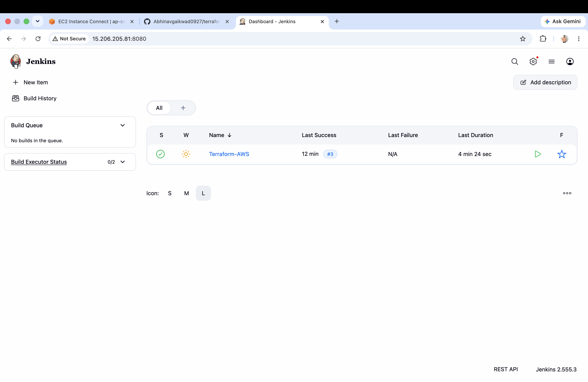
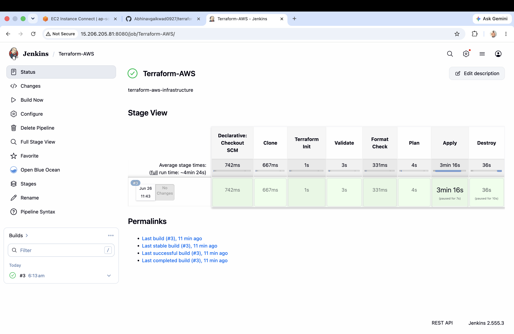
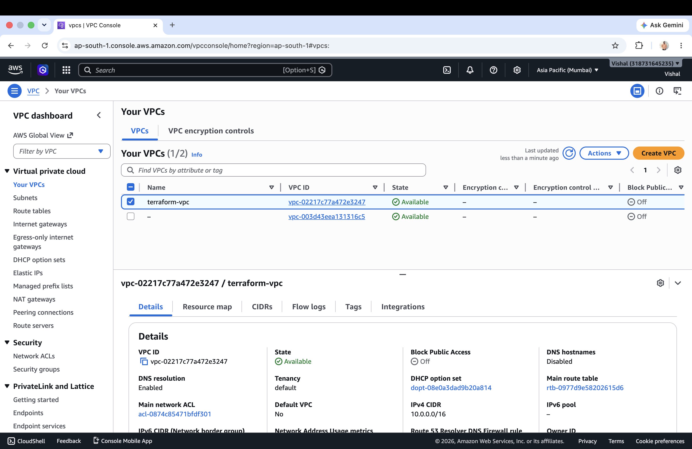
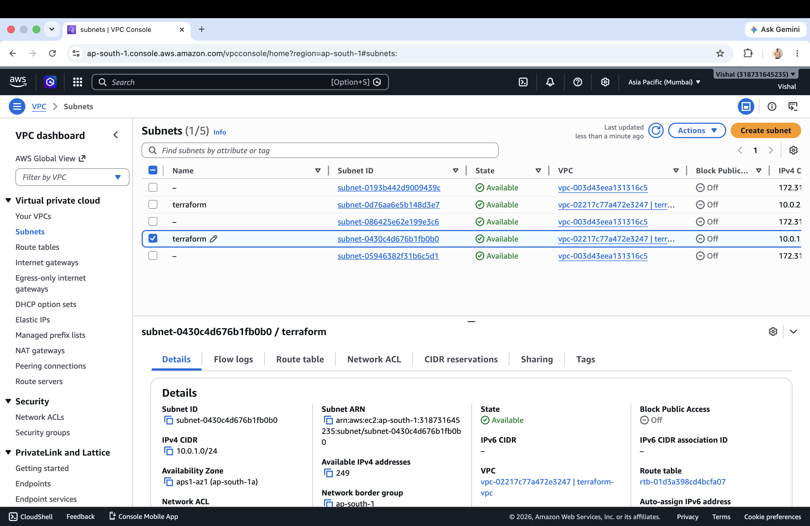
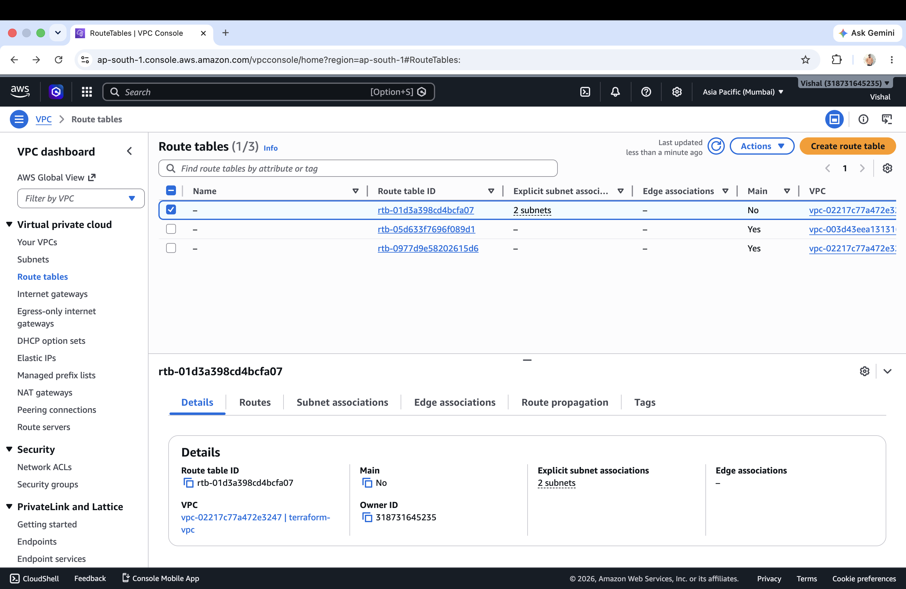
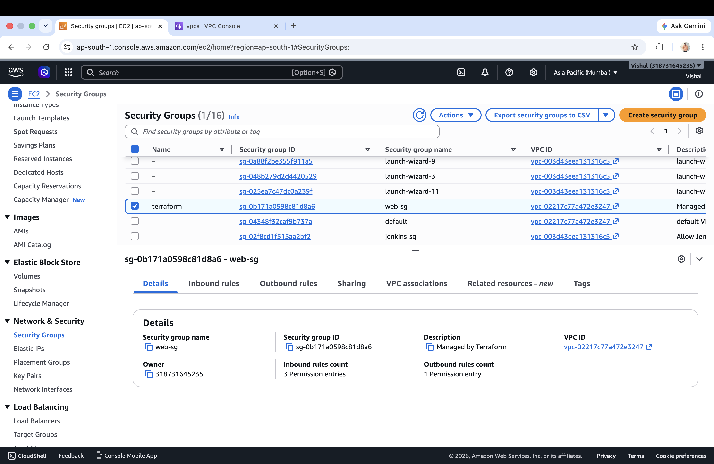
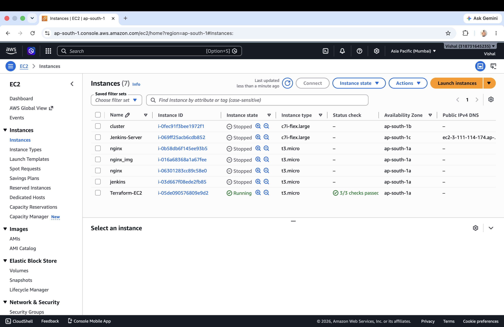
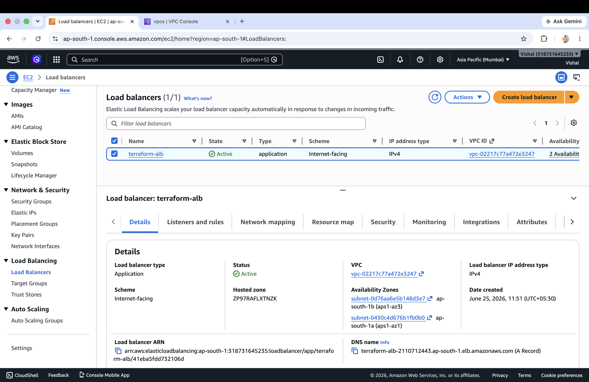
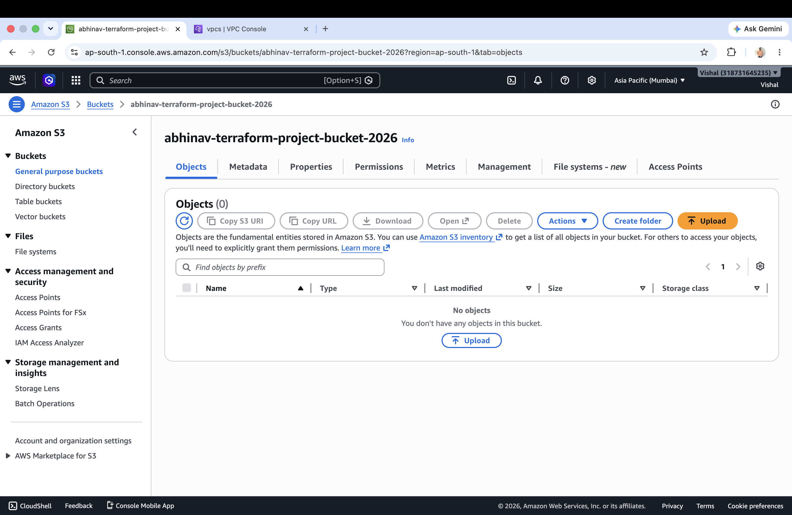

# 🚀 Terraform AWS Infrastructure Automation using Jenkins CI/CD


---

# 📌 Project Overview

This project demonstrates **Infrastructure as Code (IaC)** by provisioning AWS infrastructure using **Terraform Modules** and automating deployment through a **Jenkins CI/CD Pipeline**.

Whenever code is pushed to GitHub or the Jenkins pipeline is triggered, Jenkins executes the Terraform workflow and provisions the AWS infrastructure automatically.

The project is designed using a **modular architecture**, making it reusable, scalable, and easier to maintain.

---

# 🛠 Tech Stack

- Terraform
- AWS
- Jenkins
- Git
- GitHub
- Infrastructure as Code (IaC)

---

# 🏗 Architecture

```text
GitHub Repository
        │
        ▼
Jenkins Pipeline
        │
        ▼
Terraform Init
        │
        ▼
Terraform Validate
        │
        ▼
Terraform Plan
        │
        ▼
Terraform Apply
        │
        ▼
AWS Infrastructure
```

---

# 📦 AWS Resources Created

The Jenkins pipeline provisions the following AWS resources:

- ✅ VPC
- ✅ Internet Gateway
- ✅ Route Table
- ✅ Route Table Association
- ✅ Two Public Subnets
- ✅ Security Group
- ✅ EC2 Instance
- ✅ Application Load Balancer (ALB)
- ✅ Target Group
- ✅ Listener
- ✅ S3 Bucket
- ✅ Terraform Outputs

---

# 📂 Project Structure

```text
terraform-aws-infra/
│
├── modules/
│   ├── vpc/
│   ├── subnet/
│   ├── internet-gateway/
│   ├── route-table/
│   ├── security-group/
│   ├── ec2/
│   ├── alb/
│   └── s3/
│
├── screenshots/
│
├── .gitignore
├── Jenkinsfile
├── README.md
├── main.tf
├── outputs.tf
├── provider.tf
├── terraform.tfvars
└── variables.tf
```

---

# 📦 Terraform Modules

| Module | Purpose |
|---------|----------|
| VPC | Creates a custom VPC |
| Subnet | Creates two public subnets |
| Internet Gateway | Enables internet access |
| Route Table | Routes traffic through the Internet Gateway |
| Security Group | Configures inbound and outbound rules |
| EC2 | Launches an EC2 instance |
| ALB | Creates an Application Load Balancer |
| S3 | Creates an S3 bucket |

---

# 🔄 Jenkins CI/CD Pipeline Workflow

The Jenkins pipeline performs the following stages automatically.

| Stage | Description |
|-------|-------------|
| 1 | Checkout source code from GitHub |
| 2 | Initialize Terraform (`terraform init`) |
| 3 | Validate Terraform configuration (`terraform validate`) |
| 4 | Generate execution plan (`terraform plan`) |
| 5 | Provision AWS infrastructure (`terraform apply -auto-approve`) |
| 6 | Display Terraform outputs (ALB DNS & EC2 Public IP) |

---

## Pipeline Flow

```text
GitHub Repository
        │
        ▼
Jenkins Pipeline
        │
        ▼
Terraform Init
        │
        ▼
Terraform Validate
        │
        ▼
Terraform Plan
        │
        ▼
Terraform Apply
        │
        ▼
AWS Infrastructure Created
```

---

## Pipeline Outcome

- ✅ Fetches the latest Terraform code from GitHub
- ✅ Initializes Terraform
- ✅ Validates Terraform configuration
- ✅ Generates an execution plan
- ✅ Creates AWS infrastructure automatically
- ✅ Displays Terraform outputs after deployment

---

# 📸 Screenshots

## Jenkins Dashboard



---

## Jenkins Stage View



---

## AWS VPC



---

## Public Subnets



---

## Route Table



---

## Security Group



---

## EC2 Instance



---

## Application Load Balancer



---

## S3 Bucket



---

# ▶️ How to Run

### Clone Repository

```bash
git clone https://github.com/Abhinavgaikwad0927/terraform-aws-infra.git
```

### Move into Project

```bash
cd terraform-aws-infra
```

### Initialize Terraform

```bash
terraform init
```

### Validate

```bash
terraform validate
```

### Plan

```bash
terraform plan
```

### Apply

```bash
terraform apply
```

Or simply trigger the **Jenkins Pipeline**, which executes all Terraform stages automatically.

---

# 📚 Learning Outcomes

Through this project, I gained practical experience in:

- Infrastructure as Code (IaC)
- Terraform Modules
- AWS Networking
- VPC Architecture
- EC2 Deployment
- Security Groups
- Route Tables
- Internet Gateway
- Application Load Balancer
- Target Groups
- S3 Bucket Provisioning
- Terraform Variables
- Terraform Outputs
- Jenkins CI/CD
- Git & GitHub

---

# 🚀 Future Improvements

- Remote Backend using S3
- DynamoDB State Locking
- Auto Scaling Group
- Launch Templates
- Route53 Integration
- HTTPS with ACM
- Multi-Environment Deployment (Dev, QA, Prod)
- GitHub Actions CI/CD
- CloudWatch Monitoring

---

# 👨‍💻 Author

**Abhinav Gaikwad**

GitHub: https://github.com/Abhinavgaikwad0927

---

⭐ If you found this project useful, consider giving it a Star.
